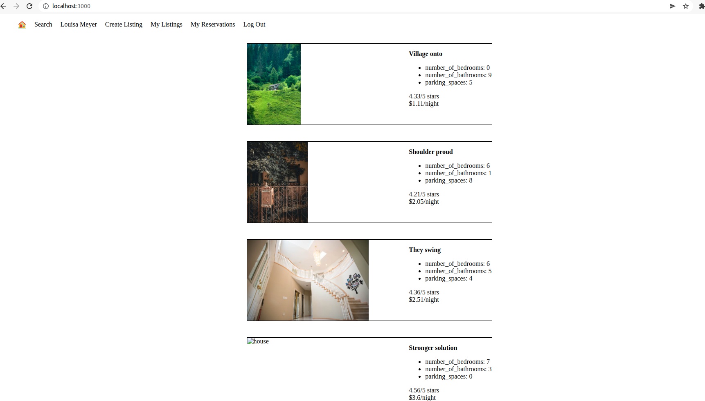
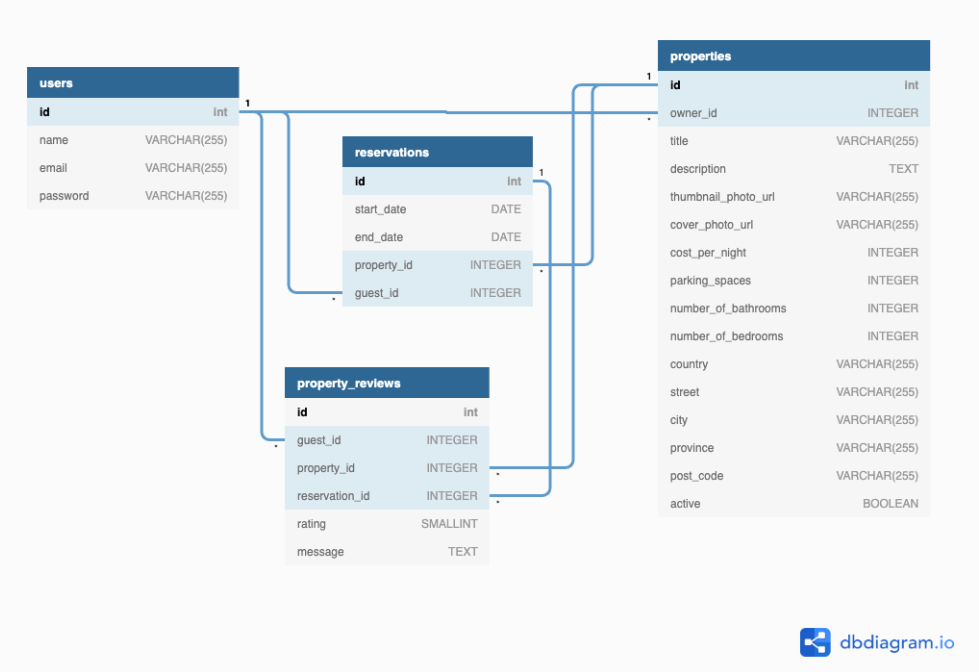

# LightBnB

Learning project connecting database queries with front end, mimicking popular app airbnb. 

* `1_queries` contains SQL files to interact with the DB.
* `LightBnB_WebApp` contains in part a pre-build front end app, for the scope of this project, database.js was the file worked on.
* `Migrations` and `seeds` contain the database schema and data. 

## Getting started:

1) Create a new repository using this repository as a template.
2) Clone your repository onto your local device.
3) Install dependencies using the `npm i` command.
4) Navigate to folder LightBnB_WebApp. 
5) Start the web server using the `npm run local` command. The app will be served at http://localhost:3000/.
6) Go to http://localhost:3000/ in your browser.

## Additional dependencies: 

You may need to have npx installed first. npm install -g npx 

## Screenshots:

Front End view of the app: 

ERD of the database as per Lighthouse Labs requirements (source: Compass, lighthouse labs):

